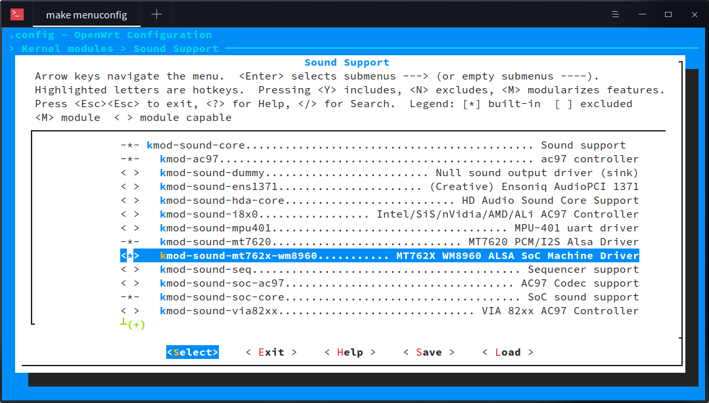
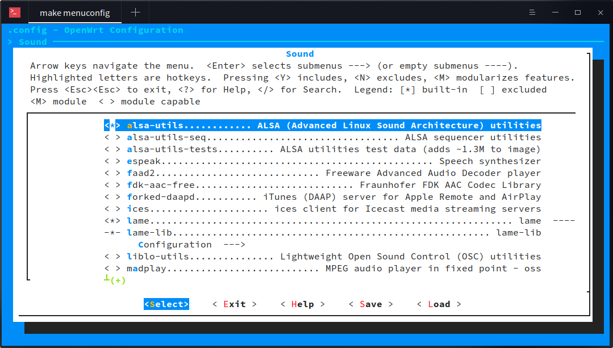

RT5350F WM8988 ALSA SoC machine driver
=====================================

ALSA SoC machine driver for RT5350F SoCs with WM8988 CODEC chip.

## Requirements

* OpenWrt with kernel 4.9 or later.

## Preparing

* Add the `rt5350f-wm8988` folder to the `package/kernel` folder of OpenWrt.
```
cd package/kernel
git clone https://github.com/PandGComunity/rt5350f-wm8988.git
```
* Modify the target DTS file in the `target/linux/ramips/dts` folder of OpenWrt according to the example DTS files.

### WM8988 ADCLRC

The WM8988 can internally get `ADCLRC` from `DACLRC` and the `ADCLRC` pin can be used as `GPIO1`. It is useful for some boards that only have the `DACLRC` pin connected and the `ADCLRC` pin is left floating. To enable this feature, modify the dts file as follows:
```
codec: wm8988@1a {
	compatible = "wlf,wm8988";
	reg = <0x1a>;
	wlf,shared-lrclk;
	wlf,adclrc-as-gpio;
};
```

## Configuring the OpenWrt

`make menuconfig`

### Kernel modules:

* Navigate to `> Kernel modules > Sound Support`.
* Select `kmod-sound-core` and `kmod-sound-rt5350f-wm8988`.



### Userspace tools:

* Navigate to `> Sound` and select `alsa-utils`.



## Building the image

`make -j9 V=s`

## Settings

Examples of `/etc/asound.conf`:

* `examples/asound.conf.alsa` for ALSA only.
* `examples/asound.conf.pulse` for PulseAudio.

The WM8988 will be muted after a reboot. Remember to properly set the volume before playing.

```
amixer sset "Headphone" 90
amixer sset "Speaker" 90
```

### Playback

```
amixer sset "Left Output Mixer PCM" on
amixer sset "Right Output Mixer PCM" on
```

### Capture

```
amixer sset "Left Input Mixer Boost" on
amixer sset "Right Input Mixer Boost" on
amixer sset "ALC Function" "Stereo"
```

## References

### WM8988 block diagram


